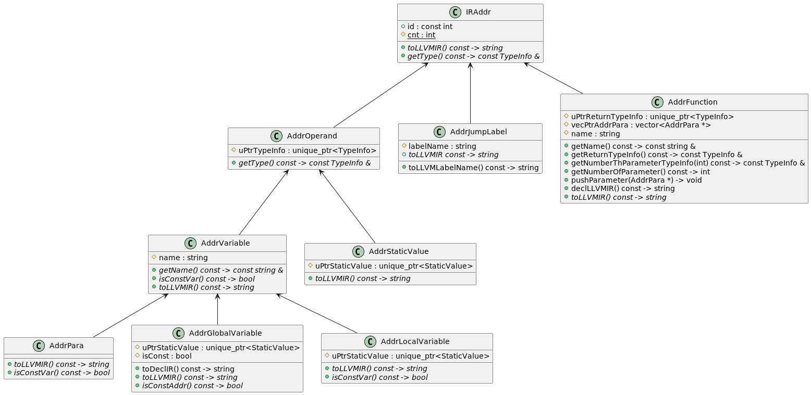

# Type System and Address Type



# HIR Instructions

## Terminator Instructions

### ret

#### Format

```text
ret <Type> <Operand>
ret void 
```

### br

#### Format

```text
br i1 <Operand:cond>, <Label:ifTrue>, <Label:ifFalse>
br label <Label:dest>
```

First one is if-branch, type of `cond` is `i1`.

## Binary Operation

### add

#### Format

```text
<Var:dest> = add <Type:opType> <Operand>, <Operand>
```

Two operands is of `opType` type. In fact, since `add` is for addition on
integer, `opType` can only be `i32`.

Type of `dest` is `opType` too.

### fadd

#### Format

```text
<Var:dest> = fadd <Type:opType> <Operand>, <Operand>
```

Two operands are of `opType` type. In fact, since `fadd` is for addition on
float-pointer numbers, `opType` can only be `float`.

Type of `dest` is `opType` too.

### others

Other instructions of this type:

* For signed integer:
  `sub`, `mul`, `sdiv`, `srem`
* For float:
  `fsub`, `fmul`, `fdiv`

## Memory Access and Addressing Operation

### alloca

#### Format

```text
<Var:dest> = alloca <Type:toStore>
```

Type of `dest` is pointer type pointing to type `toStore`.

### load

#### Format

```text
<Var:to> = load <Type:typeOfVal>, <Type:typeOfPointer> <Var:from>
```

Type of `to` is `typeOfVal` and type of `from` is `typeOfPointer`.

`typeOfPointer` is pointer type pointing to `typeOfVal`.

### store

#### Format

```text
store <Type:valType> <Operand:from>, <Type:ptrTo> <Var:to>
```

Type of `to` is `ptrTo`, and `ptrTo` is type of pointer to `valType`.

Type of `from` is `valType`.

### getelementptr

#### Format

```text
<Var:elePtr> = getelementptr <Type:base>, <Type:ptrBase> <Var:ptrFrom> {, <Type:idxType> <Operand:idx>}*
```

Type of `elePtr` is NOT `base`! Type of `elePtr` will be the value gotten from this
instruction. There is no type deduction for this instruction(what a pity).

Type of `ptrFrom` is `ptrBase`, which is pointer type to `base`. In fact, `base` has
no meaning to in our ir, we have this only because llvm-ir has it.

`idxType` is integer type (`i1` or `i32` for now).

## Conversion Operation

### fptosi

#### Format

```text
<Var:to> = fptosi <Type:fromType> <Operand:from> to <Type:toType>
```

Type of `to` is `toType` and type of `from` is `fromType`.

`fromType` is float point number type and `toType` is integer type.

### sitofp

#### Format

```text
<Var:to> = sitofp <Type:fromType> <Operand:from> to <Type:toType>
```

Type of `to` is `toType` and type of `from` is `fromType`.

`fromType` is integer type and `toType` is float point number type.

## Call Instruction

### call

#### Format

```text
[<Var:retval> = ]call <Type:retType> <Func:func>({<Type:argType> <Operand:argVal>}*)
```

Return value should be saved on `retval`, which is of `retType`.

`argType`s are same as type of parameters of `func`.